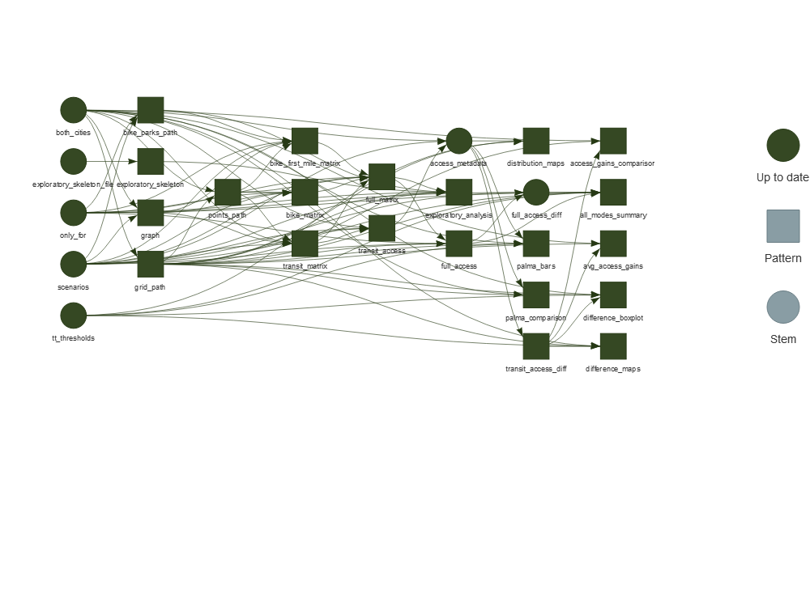

# Avaliações de intervenções de transporte público - IPEA/MDR

Repositório oficial dos relatórios de avaliações de intervenções de
transporte público nas cidades de Fortaleza e Goiânia, produzidos no
âmbito do Projeto Acesso Oportunidades (IPEA) em parceria com o
Ministério do Desenvolvimento Regional.

## Instalação

Para rodar as análises desse projeto é importante clonar o repositório
em um local adequado. **Dentro da pasta `git_<seunome>`**
(e.g. `Proj_access_oport/git_daniel`) rode:

    git clone https://github.com/ipeaGIT/avaliacao_intervencoes.git

O projeto faz uso do pacote
[`{targets}`](https://github.com/ropensci/targets) de gestão de fluxo de
*pipeline* de projetos. Infelizmente, alguns *targets* apontam para o
caminho absoluto de alguns arquivos, e não relativos (por “culpa” do
`{rmarkdown}`), portanto é importante que o dispositivo `storage6`
esteja mapeado no sistema como `L://`. Ou seja, o caminho
`//storage6/Proj_access_oport/...` deve estar mapeado como
`L://Proj_access_oport/...`.

Uma vez devidamente configurado, rode o arquivo `_targets.R` pra
carregar as bibliotecas necessárias. Você pode visualizar as
dependências do código em forma de grafo com o seguinte comando:

``` r
tar_visnetwork(targets_only = TRUE)
```



Para rodar novamente o *pipeline* do projeto respeitando as dependências
especificadas após fazer mudanças no código, use o comando:

``` r
tar_make()
```
