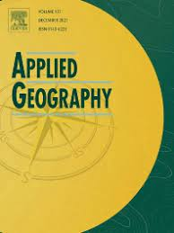

# A time interval metric for cumulative opportunity accessibility 

This repository contains the code used to write the study:

- Tomasiello, D. B., Santos, D. H. M., Oliveira, J. L. A., Braga, C. K. V., & Pereira, R. H. M. (2022). **A time interval metric for cumulative opportunity accessibility**. *Applied Geography*, 157, 103007. [https://doi.org/10.1016/j.apgeog.2023.103007](https://doi.org/10.1016/j.apgeog.2023.103007)

  - [Ungated PDF of the paper available here](https://www.urbandemographics.org/publication/2023_ag_time_interval_cumulative_access/).

